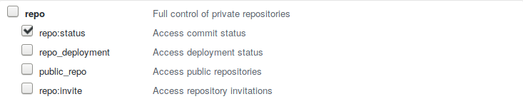
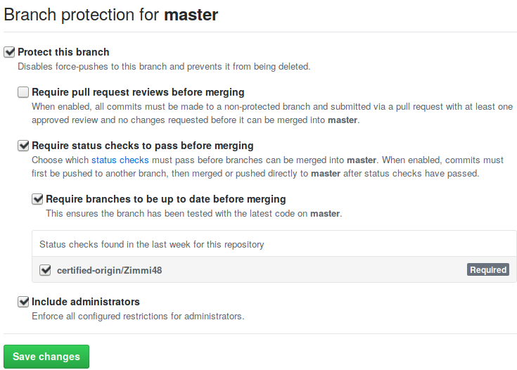

# Limit to one pusher thanks to certified-origin GitHub status check

Piggy-back on GitHub required status check to restrict pushing
to just one user, even when there are other administrators of the
repository.

## How to use?

1. Create a personal access token in your personal settings (sub-section: "Developer settings"). Select `repo:status`.
   
1. Copy `certify-origin.sh` to `.git/hooks/pre-push` and fill the missing information.
2. Push at least one new commit.
3. Protect your branch in your repository settings (sub-section: "Branches").
   .
